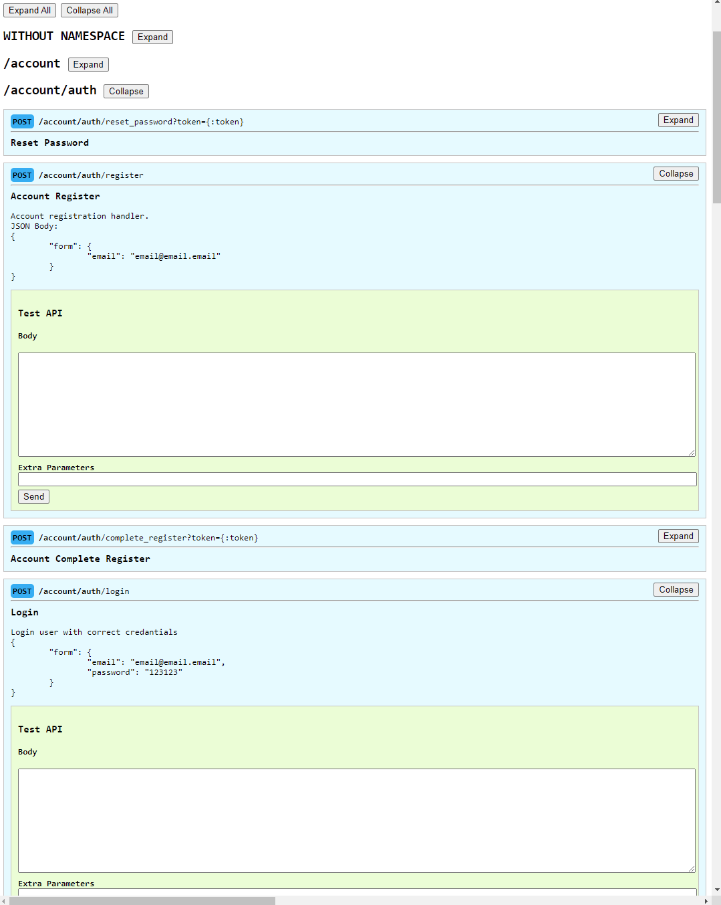
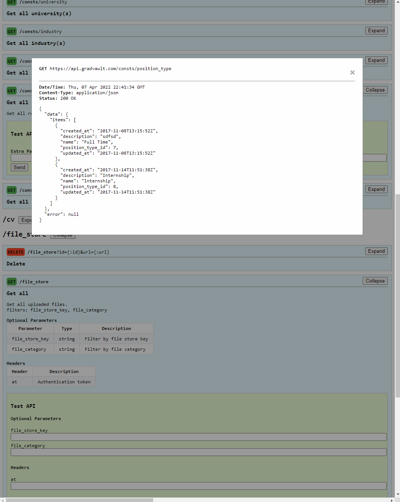

# AZ very fast http router with middleware and self documentation

It is a lightweight high performance HTTP request router for Go.

In contrast to other routers it don`t have pattern matching and all parameters is passed by url query parameters. It is like function call with arguments throw HTTP.

It has extendable middleware system and it is self documenting with GUI  view and test routes

## Example:
- Req: GET /ping
- Res: "pong"
```go
Router.Route("/ping", Router.Handler(func(w http.ResponseWriter, r *http.Request) {
		w.Write([]byte("pong"))
}))
```
more complicated:

- Req: GET /admin/user?name=Ernest //only match get request with parameter name
- Res: "user name is Ernest"
- Req: GET /admin/user?hobby=sport //only match get request with parameter hobby
- Res: "your hobby is sport"
- Req: POST /admin/user?id=10 //only match post request with parameter id
- Res: "I done with id=10"
```go
a := API.Router.Namespace("admin")
a.Route("/user",
    Router.Method("get",
        Router.Param("name",
            Router.Handler(func(w http.ResponseWriter, r *http.Request) {
                name := r.URL.Query().Get("name")
		        w.Write([]byte("user name is" + name))
            })
        ),
        Router.Param("hobby",
            Router.Handler(func(w http.ResponseWriter, r *http.Request) {
                name := r.URL.Query().Get("hobby")
		        w.Write([]byte("your hobby is" + hobby))
            })
        )
    ),
    Router.Method("post",
        Router.Param("id",
            Router.Handler(func(w http.ResponseWriter, r *http.Request) {
                id := r.URL.Query().Get("id")
                // do something with id 
		        w.Write([]byte("I done with id=" + id))
            })
        )
    )
)
```



